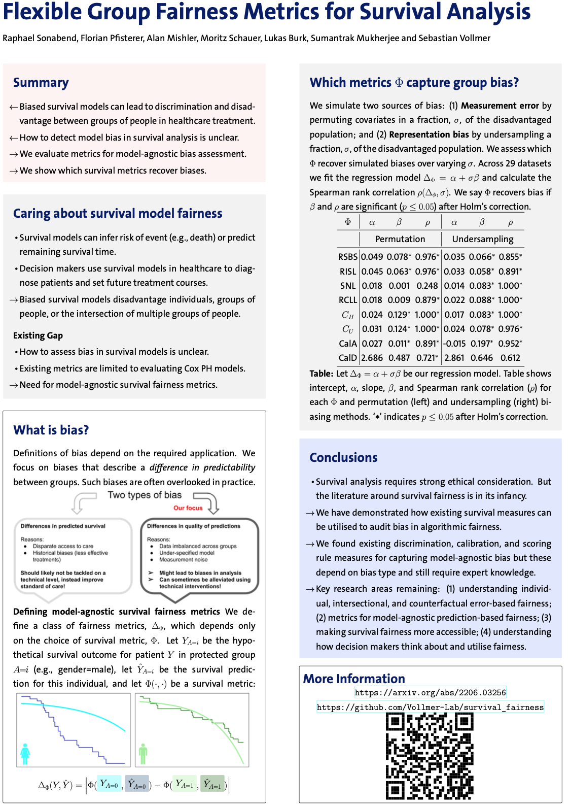

# Flexible Group Fairness Metrics for Survival Analysis. 
## Sonabend, R., Pfisterer, F., Mishler, A., Schauer, M., Burk, L., Mukherjee, S. & Vollmer, S. (2022). [http://arxiv.org/abs/2206.03256](http://arxiv.org/abs/2206.03256). 

All content in this repository is licenced under [CC BY 4.0](https://creativecommons.org/licenses/by/4.0/). All code is licenced under [MIT](https://github.com/Vollmer-Lab/survival_fairness/blob/main/LICENSE).

___

# Links

| Paper | Presentation | Experiment | Workshop |
|---|---|---|
| 1. [Paper](http://arxiv.org/abs/2206.03256) 2. [Citation](https://github.com/Vollmer-Lab/survival_fairness/blob/main/CITATION) | 3. [Video](https://youtu.be/Cte0R-8GDtw) 4. [Slides](https://github.com/Vollmer-Lab/survival_fairness/blob/main/survival_fairness.pptx) | 5. [Code](https://github.com/Vollmer-Lab/survival_fairness/tree/main/code) 6. [Results](https://github.com/Vollmer-Lab/survival_fairness/tree/main/results) 7. [Datasets](https://github.com/Vollmer-Lab/survival_fairness/blob/main/code/README.md) | 8. [Website](https://dshealthkdd.github.io/dshealth-2022/)

___

# Poster

